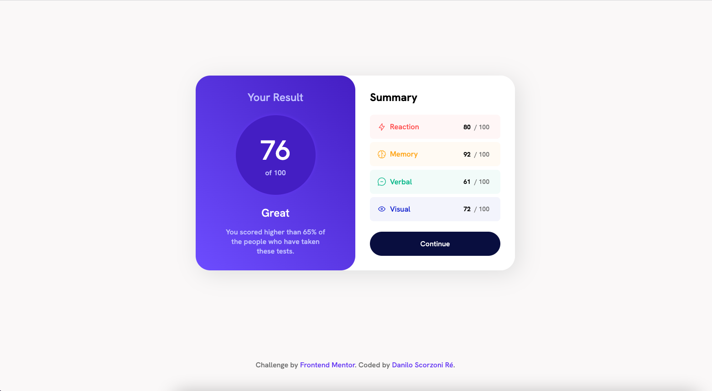
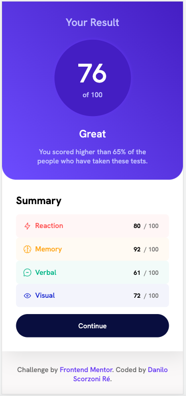

# Frontend Mentor - Results summary component solution

This is a solution to the [Results summary component challenge on Frontend Mentor](https://www.frontendmentor.io/challenges/results-summary-component-CE_K6s0maV). Frontend Mentor challenges help you improve your coding skills by building realistic projects.

## Table of contents

- [Overview](#overview)
  - [The challenge](#the-challenge)
  - [Screenshot](#screenshot)
  - [Links](#links)
- [My process](#my-process)
  - [Built with](#built-with)
  - [What I learned](#what-i-learned)
  - [Useful resources](#useful-resources)
- [Author](#author)
- [Acknowledgments](#acknowledgments)

## Overview

### The challenge

Users should be able to:

- View the optimal layout for the interface depending on their device's screen size
- See hover and focus states for all interactive elements on the page

### Screenshot

Desktop Version:



Mobile Version:



### Links

- Solution URL: [Github Repository](https://github.com/dscorzoni/projects-summary-component)
- Live Site URL: [Github Pages](https://dscorzoni.github.io/projects-summary-component/)

## My process

### Built with

- Semantic HTML5 markup
- CSS custom properties
- Flexbox
- Media Queries

### What I learned

I've learned how to use media queries to make minor changes to styling for responsiveness. In this case, the change was made in the borders of the Your Result box.

```css
@media screen and (max-width: 500px) {
  article .your-result {
    border-radius: 0rem 0rem 2rem 2rem;
  }
}
```

### Useful resources

- [Using Media Queries](https://developer.mozilla.org/en-US/docs/Web/CSS/CSS_media_queries/Using_media_queries) - Great explanation on how media queries work and many examples.

## Author

- Website - [Danilo Scorzoni Ré](https://www.github.com/dscorzoni)
- Frontend Mentor - [@dscorzoni](https://www.frontendmentor.io/profile/dscorzoni)
- LinkedIn - [@dscorzoni](https://www.linkedin.com/in/dscorzoni/)
